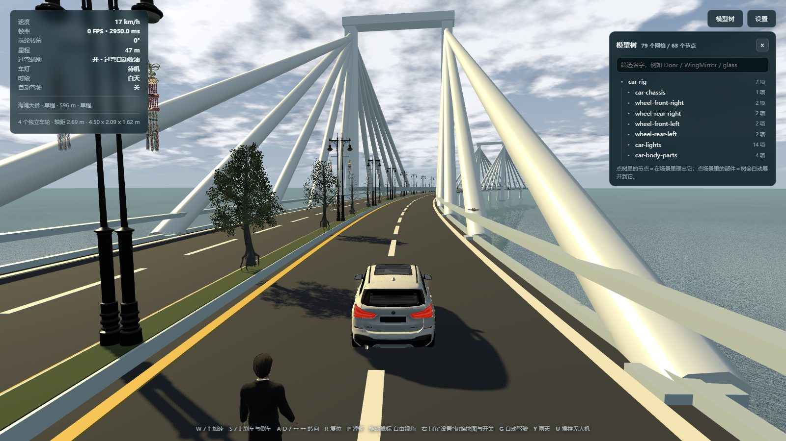
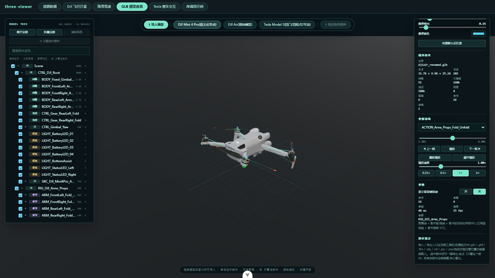
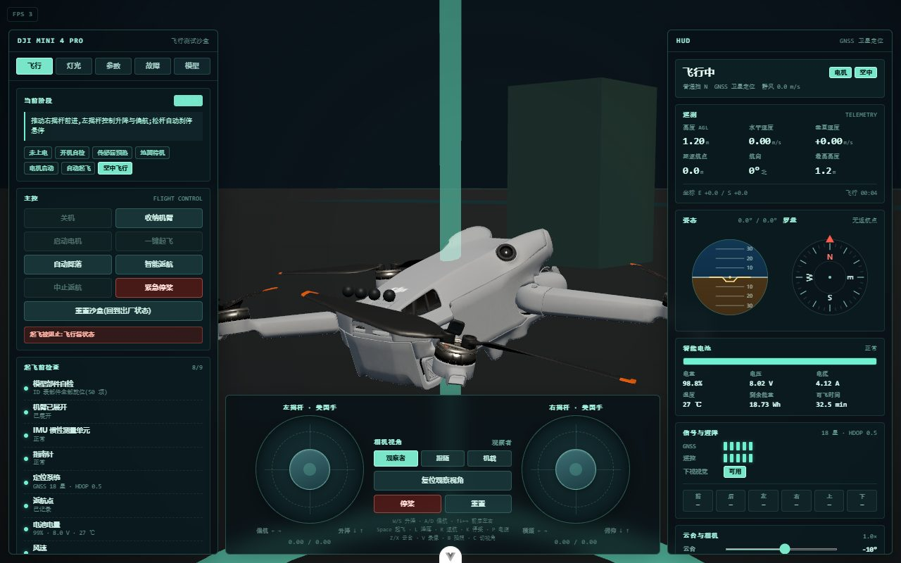
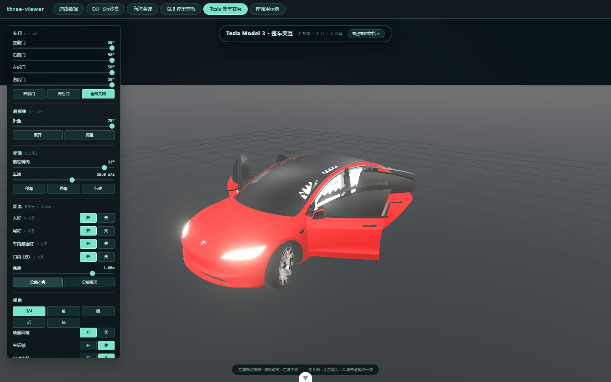

# ThreeViewer

基于 **Vue 3 + Three.js(WebGPU) + Cesium** 的 3D / GIS 可视化工具集:模型查看、无人机仿真、海上竞速、车型交互,全部跑在浏览器里,无需安装。

**🌐 在线体验(点开即玩,无需安装):https://three-viewer-demo.app.workbuddy.host/**



## 功能一览

### 🧊 GLB 模型查看器 · `/glb`

通用的 3D 模型查看器,也是整个项目的起点:

- **多格式加载**:glb / gltf / fbx / obj / stl / ply / dae,支持把 `.mtl`、贴图、`.bin` 等外部资源一并拖入
- **场景树**:逐节点显隐、只看当前部件(隔离显示)、部件定位
- **骨骼查看与骨骼动画**:骨架辅助线(骨节链 / 驱动指向 / 局部坐标轴)、动画时间轴、逐帧步进、循环方式、变速播放 —— 模型带骨骼时自动出现,不带时自动隐藏
- **模型体检**:三角面 / 顶点 / 材质 / 纹理显存 / 绘制调用量化统计,健康度评分 + 问题清单(超大贴图、缺 UV、材质碎片化…),评分只看模型固有指标、可重复
- **压缩与导出**:一键 meshopt 压缩(实测 7.7 MB → 4.2 MB,省 46%),导出 glb / gltf / obj / stl;相机缩放范围随模型尺度自适应(厘米级 FBX 也能正常取景缩放)



### 🌊 海湾竞速 · `/race`

跨海大桥场景的驾驶 + 无人机双体验:

- 车辆沿车道自动巡航,可随时切手动驾驶
- **无人机接管**:按键整体从车辆移交无人机(起降 / 平移 / 偏航 / 云台俯仰 / 返航),交还后立刻回到车辆
- 跟拍 ↔ 机载 FPV 视角一键切换,雨天、海面、桥梁光影
- 载入时预编译全部着色器,载入条消失即可上手 —— 不再有"加载完了却卡住好几秒"

### 🚁 DJI 飞行沙盒 · `/dji`

DJI Mini 4 Pro 的"数字孪生"练习场:

- 完整起飞流程:自检 → 起飞检查表 → 电机启动 → 一键起飞
- 真实感 HUD:高度 / 速度 / 距离、姿态仪、罗盘、电池、图传信号
- 机械细节:机臂折叠、桨叶差速、云台俯仰、状态灯
- 智能航向、急停悬停、失控保护等飞行逻辑



### 🚗 Tesla 车型交互 · `/tesla`

Model 3 的可交互展厅:四门开合、后备箱、大灯 / 尾灯 / 氛围灯、行驶与转向、多机位镜头,基于带骨骼的整车模型驱动。



### 🗺 道路数据演示 · `/roads`

Cesium + PostGIS 的 GIS 套件:动态 MVT 瓦片、道路搜索定位、点 / 线 / 面空间查询。需要本地 PostgreSQL 服务(见下文「道路 MVT 演示」)。

### 📦 three-engine 库示例 · `/lib-demo`

核心能力沉淀为独立 npm 库 `three-engine`(纯逻辑仿真层与渲染装配层分离),此页面是各模块的可运行示例与接入指南。

## 技术栈

| 层 | 技术 |
| --- | --- |
| 框架 | Vue 3 + TypeScript + Vite |
| 渲染 | Three.js(WebGPURenderer) |
| GIS | CesiumJS + PostGIS |
| 桌面 | Electron |
| 质量 | Vitest + Playwright(全页面无头回归,数百项断言) |

**工程亮点**

- **仿真与渲染分层**:`drone-sim`(零依赖纯逻辑)→ `drone-rig`(模型机械)→ `drone-world`(环境)→ `drone-fly`(装配),逻辑可脱离浏览器单独跑
- **可复用库**:`npm run build:lib` 把 three-engine 打包为独立 npm 包(UMD + ESM)
- **回归体系**:每个功能页面都有对应的 Playwright 无头回归脚本(`scripts/verify-*.js`),合计数百项断言

## 快速上手

```sh
npm install
npm run dev          # 开发服务器
npm run build        # 类型检查 + 生产构建
npm run test:unit    # Vitest 单测
npm run electron:build   # 打包 Windows 桌面应用(release/*.exe)
```

### 在线 demo 部署

线上版本由 `dist/` 构建产物 + 一个带 SPA 回退的静态服务器组成(`/roads` 需要数据库,线上不提供):

```sh
npx vite build                   # 1. 构建
node scripts/prepare-deploy.mjs  # 2. 生成自包含部署目录 .deploy-demo/
# 3. 上传 .deploy-demo/ 到任意 Node 托管平台,启动命令 node server.mjs
```

## 道路 MVT 演示(本地)

先在 `roads_demo` 数据库执行 `server/search-index.sql` 建立搜索索引:

```sh
psql -h 127.0.0.1 -p 5432 -U postgres -d roads_demo -f server/search-index.sql
```

启动道路服务和前端:

```sh
# PowerShell
$env:PGPASSWORD="123456"
npm run server
npm run dev -- --host 127.0.0.1 --port 5175
```

打开 `http://127.0.0.1:5175/roads`:支持按名称 / 编号搜索道路并定位高亮;点、线、面空间查询(单击加点、双击完成、右键取消),结果分批加载并保持高亮。

服务接口:

- `GET /tiles/roads/{z}/{x}/{y}.pbf` — 动态 MVT 瓦片
- `GET /roads/search?q=名称或编号&limit=10` — 道路搜索
- `GET /roads/nearest?lon=116.4&lat=39.9` — 最近道路
- `POST /roads/query` — GeoJSON 空间查询
- `GET /health` — 数据库连接检查

## 打包桌面应用(Electron)

前端是绝对路径 + web history 路由 + Cesium Worker/WASM,`file://` 下无法运行,因此主进程会起一个只监听 `127.0.0.1` 的静态服务再打开窗口:

```sh
npm run electron:build   # release/ThreeViewer Setup 0.0.0.exe(安装包)+ 免安装版
npm run electron:pack    # 只出免安装目录 release/win-unpacked/(更快)
```

打包细节(防杀软锁死 asar 的一次性工作目录、图标替换、排障环境变量)见 `scripts/package.mjs` 与 `electron/main.cjs` 内注释。

## License

[MIT](LICENSE)
